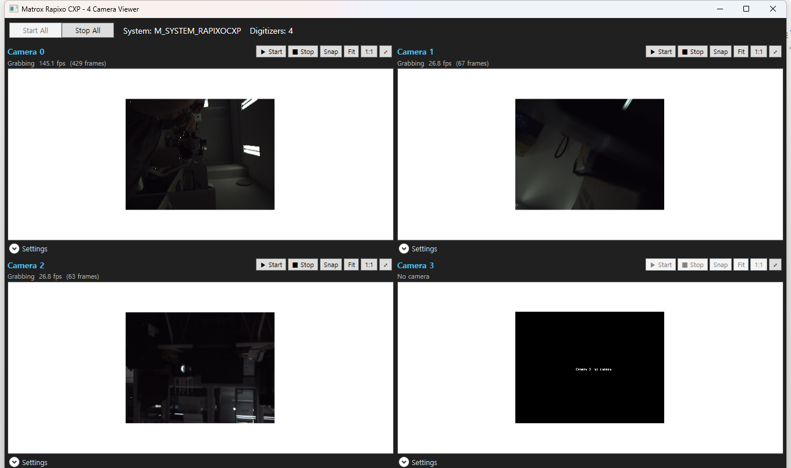

# Matrox Rapixo CXP — 멀티 카메라 뷰어

Matrox **Rapixo CXP**(CoaXPress) 프레임그래버 보드 한 장에 연결된 카메라(최대 **4대**)를
**MIL**(Matrox Imaging Library)로 실시간 표시하고 프레임마다 처리하는 C# **WPF** 애플리케이션입니다.



## 기능

- **2×2 라이브 뷰**: 하나의 Rapixo CXP 보드에서 최대 4대 (`MdigProcess` 그랩 + 프레임별 훅 처리)
- **카메라 제어**(GenICam 피처 계층): **노출**(+ 자동), **트리거**(모드/소스/소프트웨어 트리거),
  **화이트 밸런스**(자동/1회/R·B 비율), **DCF** 로드, MIL **GenICam 피처 브라우저**
- **화면 맞춤(Fit)**으로 잘림 없이 전체 표시 + 휠 **줌** / 드래그 **팬**, **1:1**,
  **더블클릭 전체화면**(ESC로 복귀)
- **스냅샷** 저장(PNG/BMP/TIFF/JPEG), 카메라별 · 전체 Start/Stop

## 요구 사항

- Windows x64, **MIL 10.70** 설치, WindowsDesktop(net6.0) 런타임이 포함된 .NET SDK
- 라이브 그랩에는 카메라가 연결된 Rapixo CXP 보드 필요 (하드웨어가 없으면 기본 MIL 시스템으로
  대체되어 "No camera" 패널 표시)

## 빌드 & 실행

```bash
dotnet build MatroxFrameGrabber.slnx -c Release
```

실행: `src/bin/x64/Release/net6.0-windows/MatroxFrameGrabber.exe`

## 프로젝트 구조

```
MatroxFrameGrabber.slnx     솔루션
src/                        소스 (Views / ViewModels / Mil / Infrastructure)
docs/                       문서 · 이미지
```

빌드 상세와 구현 노트는 [CLAUDE.md](CLAUDE.md) 참고.
